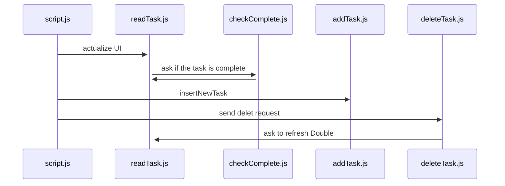

# ToDo list
The scope of this repository is to study JavaScript

## Used technologies
- HTML
- CSS
- JavaScript
- LocalStorage

# Sequence Diagram

```mermaid
sequenceDiagram
    script.js->>+readTask.js: actualize UI
    readTask.js->>+checkComplete.js: ask if the task is complete
    checkComplete.js->>+readTask.js: 
    script.js->>addTask.js: insertNewTask
    script.js->>deleteTask.js: send delet request
    deleteTask.js->>readTask.js: ask to refresh Double    
```
